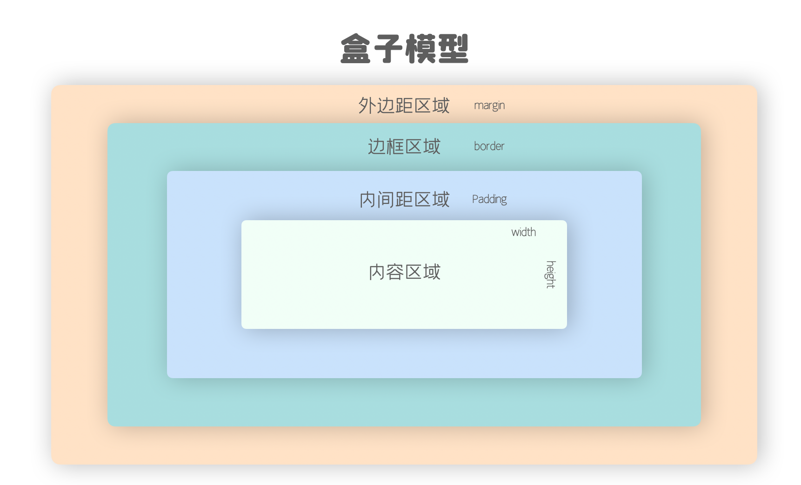

在用 CSS 布局的时候，经常会有各种怪异的情况出现，有些元素就是不在它应该在的位置上，也显示不成该有的大小，页面乱七八糟。这些其实还是因为 CSS 的布局基础没有掌握牢固且不够熟练。今天就深入了解一下 CSS 最基础也是最重要的部分 - 盒子模型，分别会讲到盒子的概念、布局方式、box-sizing 属性、特殊的盒子模型以及边距塌陷，相信你掌握了它们之后就能解决一大半的布局问题。

## 盒子模型

在 CSS 盒子模型中，每个的 HTML 元素都会被当作是一个矩形的盒子，然后对它们进行从上到下，从左到右的布局。
一个盒子通常包括四个区域，从里到外分别是：

- 内容区域 - 代表盒子的实际内容部分，它是由 width 宽度和 height 高度来确定的
- 内间距区域 - 代表盒子与实际内容之间的空白区域，由 padding 属性设置
- 边框区域 - 代表盒子的边框，是内间距区域和外边距区域的边界，由 border 属性设置
- 外边距区域 - 代表此盒子的边框与相邻的其他盒子边框之间的距离，由 margin 属性设置



那么怎样通过这四个区域计算盒子的最终宽度和高度呢？答案是一个盒子的宽度和高度的计算方式，会根据盒子的类型而不同。

## 盒子的类型

CSS 中的盒子模型有两种类型，一种是 content-box，内容盒子，一种是 border-box 边框盒子，通过 css 属性 box-sizing 来设置。这两种盒子计算宽高的方式不一样。我们先来看一下 content-box 。

### content-box

content-box 是 box-sizing 的默认值，也就是说所有的盒子默认都是内容盒子，那么这里 css 属性中的 width 和 height 设置的是它内容区域的宽高，而盒子的宽高需要加上内间距和边框，外边距不算在内。

_宽度的计算方式是：内容的宽度+左右内间距+左右边框的宽度_

_高度的计算方式则是：内容的高度+上下内间距+上下边框的宽度_

比如说有一个盒子，宽度设置为 300px，高度设置为 200px，内间距设置为 10px，边框设置为 5px，外边距设置为 20px，那么盒子的宽度则是 300 + 10 + 10 + 5 + 5 = 330，高度则是 200 + 10 + 10 + 5 + 5 = 230：

```html
<div class="box"></div>
```

```css
.box { 
  width: 300px; 
  height: 200px; 
  padding: 10px; 
  border: 5px solid lightblue;
  margin: 20px; 
}
```

### border-box

如果把 box-sizing 的值改成 border-box，那么 width 和 height 属性就是分别设置盒子的最终宽度和高度

```html
.box { box-sizing: border-box; /* ... */ }
```


``
可以看到真实的内容宽度变成了 270，高度变成了 170，加上边框和间距之后，才是设置的 width 和 height 的值

### 特殊的盒子-替换元素

css 盒子模型中还有一种特殊的盒子：替换元素。替换元素是说，它们加载的是外部内容，并不会受现有的 CSS 属性的影响。常见的替换元素有 `` 、 `<iframe>` 、 `<video>` 等，这些标签都是用来加载外部文件的，当前 HTML 页面中的 CSS 样式并不会影响它们的内容，比如说 `<iframe>` 标签加载的子页面，不会受当前页面的 CSS 影响。不过，可以通过 CSS 来控制替换元素在盒子中的位置，比如说用 ``  加载一张图片，我们可以限制 ``  盒子的宽高，然后利用 object-fit 属性，让图片等比例占满整个盒子，裁掉显示不下的部分，然后通过 object-position 来设置图片在盒子中的位置，可以是靠下或者居中等：

```html

```

```html
img { width: 300px; height: 300px; object-fit: cover; object-position: center }
```


## 盒子的布局方式

多个盒子之间会有不同的布局方式，它是通过设置显示类型来实现的。根据盒子本身与外部相邻的其他盒子之间的排列方式，还有盒子内部的子盒子之间的排列方式，我们可以把它们分为外部显示类型和内部显示类型两种。

### 外部显示类型

外部显示类型控制的是相邻盒子之间的布局，分为块级盒子和行内盒子两种。它们是浏览器默认的布局方式。

#### 块级盒子

块级盒子，比如 div，p，h1 等，它的宽度（指盒子的整体宽度）会占满整个浏览器，并且后边的盒子会被挤占到下一行去显示。

```html
<p>这是块级元素</p>
<p>这是另一块级元素</p>
```


#### 行内盒子

行内盒子比如 span, a 等，它的宽度是内容的宽度，后边的盒子会跟在它的后边继续排列。

```html
<p>在里边有一个<span>行内</span>元素</p>
<p>这是另一块级元素</p>
```


它们两者的区别是：
行内盒子无法手动设置宽高，并且垂直方向上的 padding 和 margin 虽然能够设置生效，但并不会挤占其他盒子的空间，会导致重叠。不过水平方向上的则会挤占其他盒子的空间:

```html
<p>在里边有一个<span class="inline">行内</span>元素</p>
<p>这是另一块级元素</p>
```

```html
.inline { width: 100px; height: 100px; margin: 25px; padding: 25px; }
```


块级盒子的宽高、padding 和 margin 则都会生效并且挤占空间。

```html
<p>在里边有一个块级元素</p>
<p>这是另一块级元素</p>
```

```css
p {
  width: 200px;
  height: 30px;
  margin: 24px;
  padding: 18px;
}
```


### 内部显示类型

内部显示类型则是控制这个盒子内部的子盒子之间的排列方式，上边说的 block 块级和 inline 行内盒子是正常的文档流，块级盒子内部的盒子也是按照这种方式排列，要注意的是行内盒子里边只能有行内盒子，不能有块级盒子。我们可以通过设置 display 的值来修改内部盒子的排列方式。
比如设置为 flex 可以变成流式布局 :

```html
<div class="container">
  <p>在里边有一个块级元素</p>
  <p>这是另一块级元素</p>
</div>
```

```html
.container { display: flex; }
```


设置为 grid 可以变成栅格布局  ，它们属于非正常的文档流。

```html
<div class="container">
  <p>在里边有一个块级元素</p>
  <p>这是另一块级元素</p>
</div>
```

```html
.container { display: grid; }
```


### inline-block 显示类型

如果想让一个盒子的外部类型保持 inline 行内状态，不把后边的盒子挤占到下一行，但是又想同时设置宽高、padding 和 margin，那么可以使用 inline-block  这个显示类型，这样这个盒子就有了宽高，并且无论是水平还是垂直方向上的 padding 和 margin，都可以把周围的盒子的空间挤占掉。

```html
<p>在里边有一个块级元素</p>
<p>这是另一块级元素</p>
```

```html
p { display: inline-block; wdith: 300px; padding: 20px; margin: 20px; }
```


## 边距塌陷

CSS 盒子模型中，有一个问题需要特别注意一下，如果给两个盒子同时设置外边距，那么它们最终的距离很可能并不是两个盒子的外边距之和，这种情况会发生在相邻盒子之间，也会发生在父子盒子之间。当它们同时设置了边距时，如果都是正数，则取最大值，如果相同，则取其中之一，如果有正有负，则取最大的正数加上最小的负数之和，如果都是负数，则取最小值。

### 相邻盒子之间

相邻的盒子之间的边距一般都会有塌陷的情况，比如一个盒子的下边距和下面盒子的上边距：

```typescript
<p class="p1">这是块级元素</p>
<p class="p2">这是另一块级元素</p>
```

```typescript
.p1 {
  margin-bottom: 20px;
}

.p2 {
  margin-top: 10px;
}
```

这里虽然给.p2 设置了上边距为 10px，但是他们两个的边距并不是 30px，而是取的两者的最大值 20px。

### 父子盒子之间

父子盒子的边距也会塌陷，而且塌陷时，边距会放置在父盒子的外边，子盒子和父盒子之间的边距并不会生效：比如这里，.box 和 p1 的上边距塌陷了，使用了 box 设置的值 20px，而不是 30px，并且边距在 box 的外侧，p1 和 box 之间没有边距。

```typescript
<div class="box">
  <p class="p1">这是块级元素</p>
  <p class="p2">这是另一块级元素</p>
</div>
```

```typescript
.box {
  margin-top: 20px;
}

.p1 {
  margin-top: 10px;
}
```


如果两个盒子之间有 border、padding 或者 BFC 的话，就不会有边距塌陷：

```typescript
.box {
  margin-top: 20px;
  padding: 10px;
}
```


下边距塌陷也是一样的，也在父盒子的外侧，这里给 box 和第二段文本设置下边距，可以看到最终下边距是 30px：：

```html
<div class="box">
  <p class="p1">这是块级元素</p>
  <p class="p2">这是另一块级元素</p>
</div>
<p>测试文本</p>
```

```css
.box {
  margin-bottom: 20px;
}

.p2 {
  margin-bottom: 30px;
}
```


如果下边距塌陷的盒子中间有 border、padding，或者设置了 height、min-height 等属性，就不会有塌陷，这里如果把 box 的高度设置为 150px，那么第二段文本的下边距就不会塌陷了：

```html
.box { margin-bottom: 20px; height: 150px; }
```


## 总结

我们总结一下 CSS 盒子模型的概念：

- 它是由内容区域、内间距区域、边框区域和外边距区域构成的
- 根据 box-sizing 属性的不同，盒子的宽高计算方式也不
- 有块级盒子和行内盒子两种
- 可以通过设置外部和内部显示类型改变布局方式
- 还有一种特殊盒子 - 替换元素
- 最后我们了解到了盒子的边距塌陷的情况

CSS 盒子模型是熟练布局 HTML 页面的基础，且是重中之重，只有掌握了它才能够对页面进行精确的布局，准确的预测一个元素应该在哪个位置和它的尺寸，这样就能够避免元素总是不在自己的位置上，且元素占用的空间跟想像的不一样的情况了。
